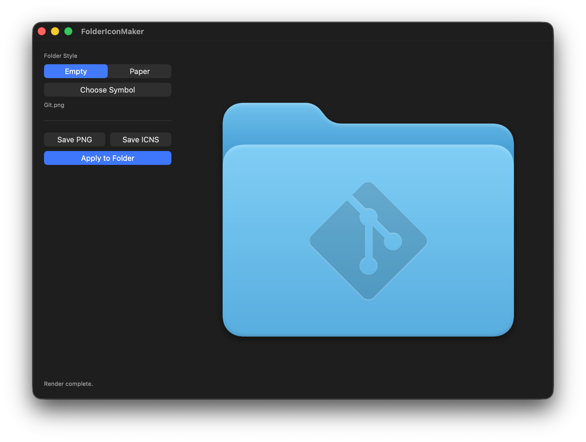
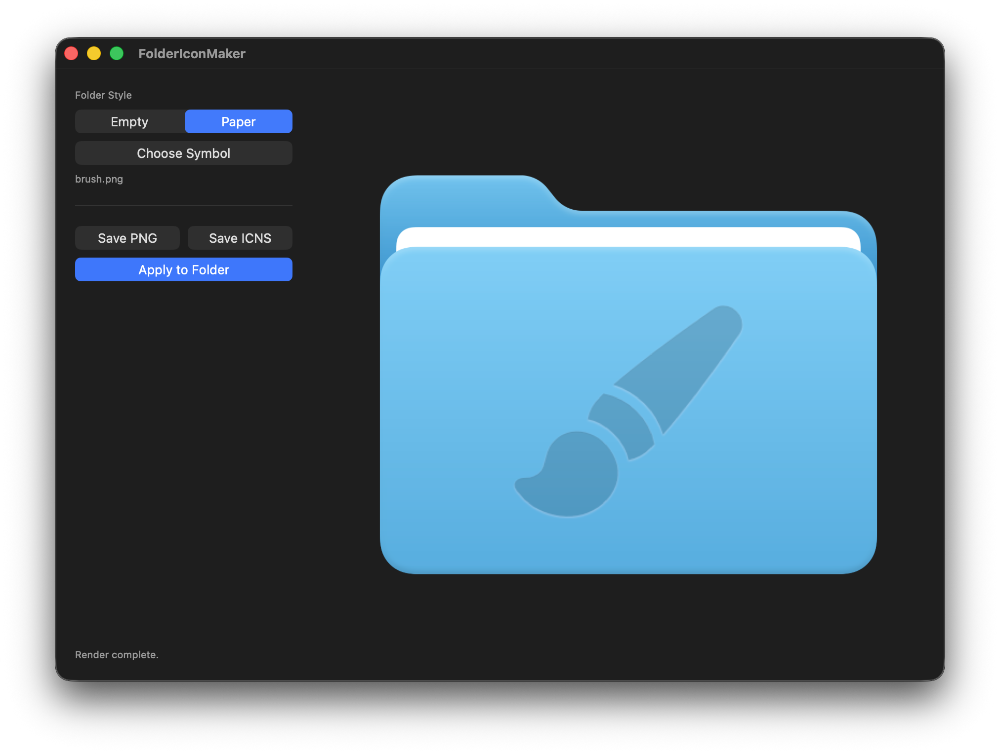

<p align="left">
  
</p>

# FolderIconMaker

FolderIconMaker is a small native macOS app for composing custom folder icons that match the look of the system folder style. macOS Tahoe's built-in folder customization is limited to emoji and SF Symbols, so FolderIconMaker lets you create folder icons with a wider range of image symbols, including PNG and SVG artwork. Pick a folder base, choose a symbol, preview the embossed result, then export it or apply it directly to a folder.

## Screenshots

<p align="left">
  
  
</p>

## Features

- Native SwiftUI macOS interface
- Empty and paper folder styles
- PNG and SVG symbol input
- Immediate preview rendering after choosing a symbol or changing folder style
- Symbol placement tuned for a 1024 x 1024 folder render canvas
- PNG export
- ICNS export
- Direct folder icon application through `NSWorkspace`
- App icon built with Apple's Icon Composer `.icon` format

## Requirements

- macOS 26.0 or later target
- Xcode with the macOS 26 SDK
- Swift 6

The project has no third-party dependencies.

## Build

Open `FolderIconMaker.xcodeproj` in Xcode and run the `FolderIconMaker` scheme.

You can also build from the command line:

```sh
xcodebuild \
  -project FolderIconMaker.xcodeproj \
  -scheme FolderIconMaker \
  -destination 'platform=macOS' \
  build
```

## Test

```sh
xcodebuild \
  -project FolderIconMaker.xcodeproj \
  -scheme FolderIconMaker \
  -destination 'platform=macOS' \
  test
```

## Usage

1. Choose a folder style: `Empty` or `Paper`.
2. Click `Choose Symbol` and select a PNG or SVG symbol.
3. Review the live preview.
4. Use `Save PNG`, `Save ICNS`, or `Apply to Folder`.

## Project Structure

```text
FolderIconMaker/
  ContentView.swift
  Exporting/
  Models/
  Rendering/
  Resources/
  SystemIntegration/
FolderIconMakerTests/
assets/
```

## Rendering Notes

FolderIconMaker renders into a 1024 x 1024 canvas. Symbols are height-limited, centered horizontally, and blended into the folder surface with a subtle emboss-style treatment so the result feels closer to a system-rendered folder icon than a flat overlay.
